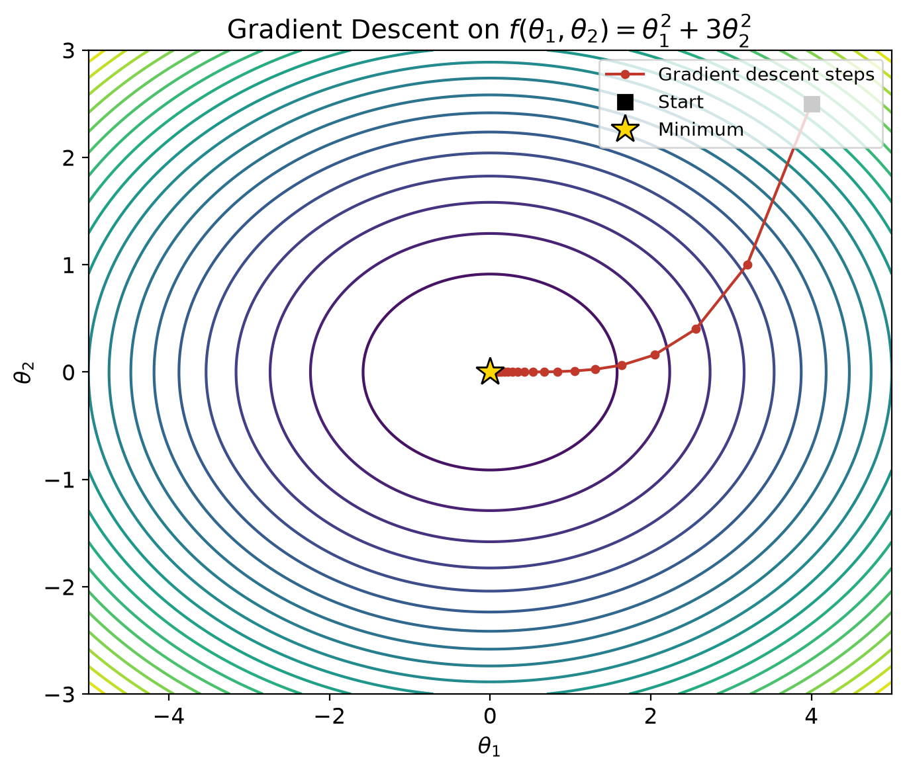
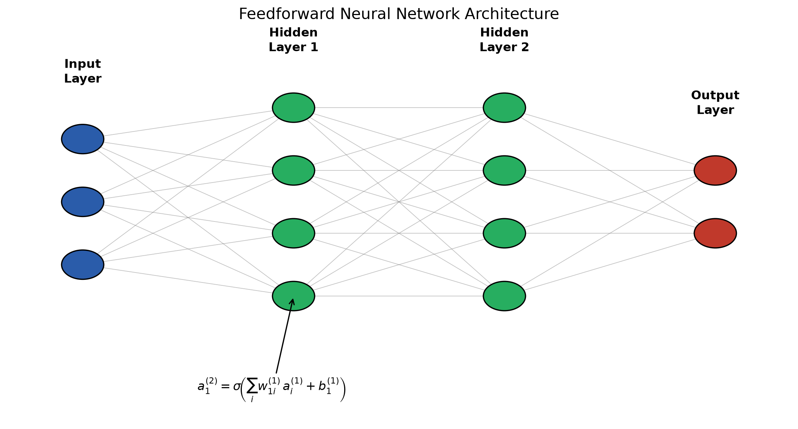
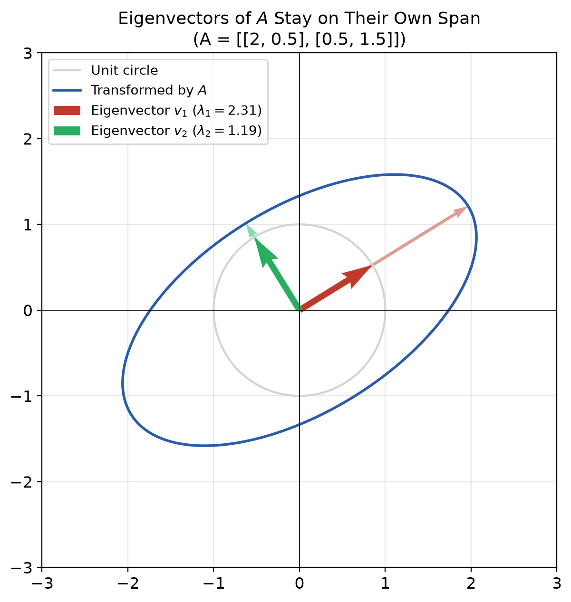
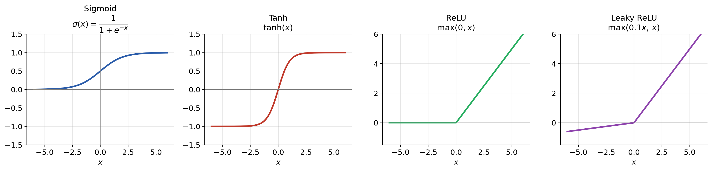

# Mathematics of Machine Learning

A set of visual LaTeX lecture notes covering the core math behind machine
learning — linear algebra, probability, optimization, regression, and
neural networks — with every concept illustrated by a generated figure.


## Preview

| | |
|---|---|
|  |  |
|  |  |

## Contents

1. **Linear Algebra Foundations** — vectors, dot products, matrix multiplication, eigenvalues/eigenvectors, PCA
2. **Probability and Statistics** — Gaussian distributions, Bayes' theorem, MLE, cross-entropy
3. **Calculus and Optimization** — gradients, the chain rule, gradient descent, convexity
4. **Regression and Classification** — linear regression, logistic regression, regularization
5. **Neural Networks and Backpropagation** — forward pass, activation functions, backprop derivation

Each chapter connects the math directly back to why it matters for ML — e.g.
why MSE loss falls out of a Gaussian noise assumption, or why ReLU avoids
vanishing gradients.

## Structure

```
.
├── main.tex                   # Title page, TOC, chapter includes
├── chapters/
│   ├── 01_linear_algebra.tex
│   ├── 02_probability.tex
│   ├── 03_optimization.tex
│   ├── 04_regression.tex
│   └── 05_neural_networks.tex
├── figures/                    # Generated PNG figures (tracked in git)
├── scripts/                    # Python/Matplotlib figure generators
│   ├── gen_activations.py
│   ├── gen_linear_algebra.py
│   ├── gen_nn_diagram.py
│   ├── gen_optimization.py
│   ├── gen_probability.py
│   ├── gen_regression.py
│   └── generate_all.py         # Runs every gen_*.py script
├── .github/
│   ├── workflows/build.yml     # CI: regenerates figures + compiles PDF
│   └── dependabot.yml          # Automated dependency update PRs
├── requirements.txt             # Pinned numpy/matplotlib versions
├── .gitattributes               # Keeps PNGs/PDFs binary-safe across OSes
└── Makefile
```

## Building locally

Requires a LaTeX distribution (e.g. TeX Live) and Python 3.

```bash
# Install pinned Python dependencies
make install

# Regenerate all figures from scratch
make figures

# Compile the PDF
make pdf

# Or all three:
make install && make all
```

## License

MIT — use it, fork it, teach with it.
